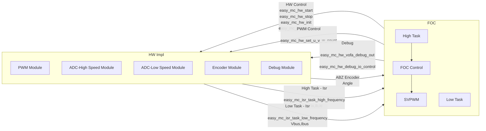
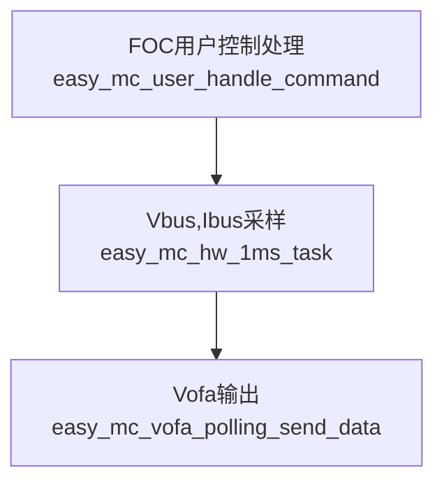
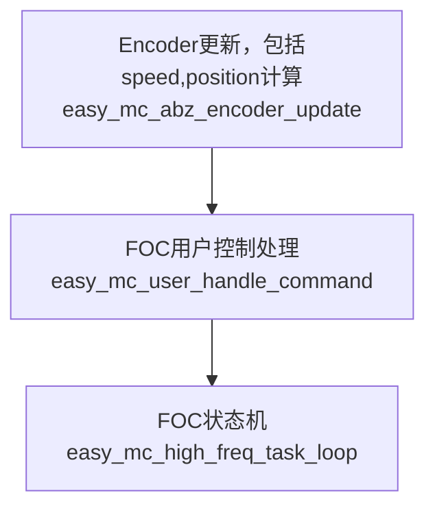
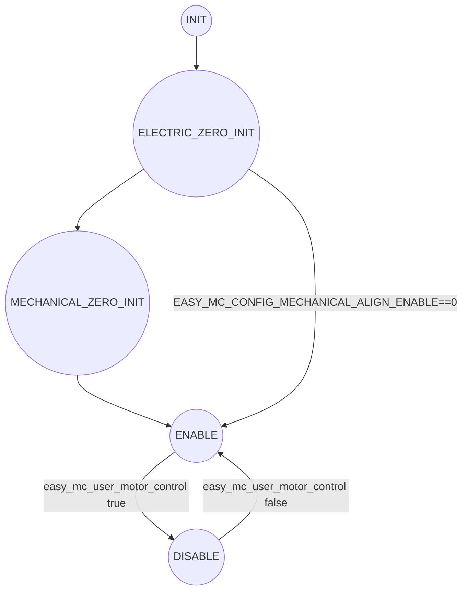
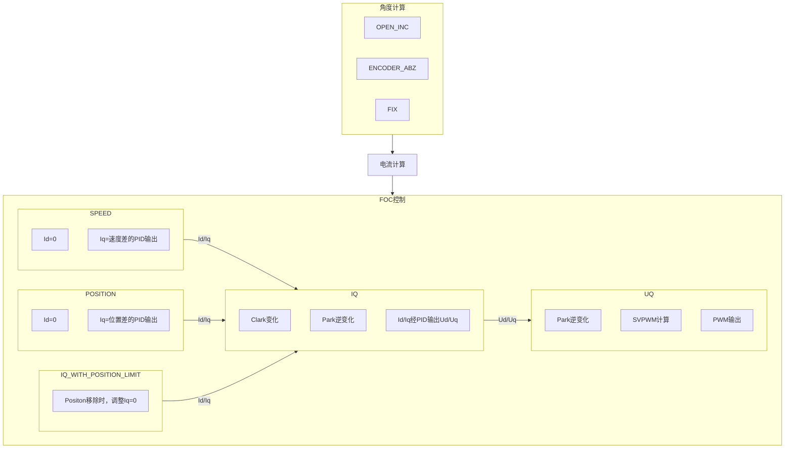

---

---

# 简介

本项目主要面对用于FOC学习，为了更清晰看懂整套算法，相关算法并没有做专门的性能优化，主要靠芯片自身的性能来完成性能优化。


# 项目特点

- 清晰明了，很多算法加了很多性能优化的处理，本项目只展示算法原理和实现，让初学者了解整套算法运行机制。
- 原理到实践，对每个硬件环境实现要求进行详细说明，并讲解测试方法和验证通过标准。


# 资料推荐

[教你写一个比SimpleFOC更好的电机库_哔哩哔哩_bilibili](https://www.bilibili.com/video/BV1cj411M7Xu/?vd_source=a9f544fd118b316fdfbef7ddae524328)，从0到1学习蛮好的。

[手把手教您使用STM32G0/G4驱动BLDC/PMSM电机_哔哩哔哩_bilibili](https://www.bilibili.com/video/BV1bY4y1k7vN?vd_source=a9f544fd118b316fdfbef7ddae524328&spm_id_from=333.788.videopod.sections)，从0到1学习，用Matlab仿真实现的示例。


# 原理介绍

[从零开始自己编写FOC 算法篇：FOC和SVPWM_哔哩哔哩_bilibili](https://www.bilibili.com/video/BV1wP4y167ao?spm_id_from=333.788.recommend_more_video.4&vd_source=a9f544fd118b316fdfbef7ddae524328)，这个视频讲得蛮好的，包含python的实现代码。

[深入浅出FOC控制-CSDN博客](https://blog.csdn.net/qq_35947329/article/details/115483413)，不喜欢视频，喜欢文字的看这个。

[【自制FOC驱动器】深入浅出讲解FOC算法与SVPWM技术 - 知乎](https://zhuanlan.zhihu.com/p/147659820)，这个也讲得不错。


## SVPWM

最核心的就是SVPWM了，这里主要参考[彻底吃透SVPWM如此简单 - 知乎](https://zhuanlan.zhihu.com/p/414721065)，文章进行实现，里面已经讲得很好了。


## 一些好看的动图

[FOC控制中，相电流，母线电流，电机功率，这三者有何关系? - 知乎](https://www.zhihu.com/question/532072197/answer/3254550464)

[[FOC 从0到1\] 带你可视化坐标变换_哔哩哔哩_bilibili](https://www.bilibili.com/video/BV1Ux4y1z7yJ/?vd_source=a9f544fd118b316fdfbef7ddae524328)


# EasyMC实现说明

FOC理论有一大堆，本质就是通过采样的Ia\Ib\Ic和Angle，控制电机的输出（PWM占空比）。

整个系统的输入为：Ia、Ib、Ic和Angle（决定FOC输出的主要输入），其他辅助的包括Vbus、Ibus之类（辅助用，并不直接觉得FOC数据）。

输出为：PWM占空比（也就是SVPWM输出）。

为了屏蔽软件和硬件行为，以便于在不同硬件板子和芯片中实现，软件分为2个部分，一个是**HW Impl**和**FOC**，其中**HW Impl**为具体硬件实现，控制具体的芯片的寄存器；**FOC**为纯软件行为。

由于FOC对时序要求很高，所以整个算法是由中断驱动运行的，**High Task**周期为PWM的周期（如10kHz和20kHz之类），**Low Task**周期为1ms中断。





## HW Impl

在不同硬件实现时，需要实现如下接口。

### HW Control

主要用于控制所有硬件模块初始化和开关。包括：

`easy_mc_hw_start`，启动PWM输出。

`easy_mc_hw_stop`，关闭PWM输出。

`easy_mc_hw_init`，完成硬件模块时钟使能和初始化。

`easy_mc_hw_deinit`，关闭硬件模块时钟。

### PWM Control

用于控制PWM的输出占空比。包括：

`easy_mc_hw_set_u_v_w_count`，控制UVW的输出占空比。


### Debug

用于满足调试需要，包括VOFA时序输出和IO Debug信号输出。包括：

`easy_mc_hw_vofa_debug_out`，需要用DMA实现，FOC会在每次Low Task中Trigger一次，在中断中，波特率要求1ms内发送完毕。

`easy_mc_hw_debug_io_control`，控制io翻转，用于调试时序信号。


### ABZ Encoder

暂时只实现了ABZ传感器，用于角度采集和z信号输入。包括：

`easy_mc_hw_encoder_get_count`，FOC算法调用，用于获取当前Encoder的计数值。

`easy_mc_hw_encoder_set_zero`，FOC算法调用，用于重置Encoder的计数值。

`easy_mc_isr_set_zero`，硬件触发调用FOC算法，用于通知FOC算法来了Z信号。


### High Task

在每次Ia、Ib和Ic采样结束后触发，之后FOC根据当前的电流和角度信息，控制PWM输出，进而达到电机控制的目的。包括：

`easy_mc_isr_task_high_frequency`，FOC核心业务，后续展开。


### Low Task

在每1ms需要触发1次，之后FOC会计算速度、调试输出、Vbus和Ibus采样这些行为。包括：

`easy_mc_isr_task_low_frequency`，FOC核心业务，后续展开。

`easy_mc_hw_1ms_task`，硬件需要实现，用于处理Vbus和Ibus采样等行为。


## FOC-Low Task

1ms触发1次，主要完成以下任务，做一些耗时但是不紧急的业务。

需要注意，考虑到用户一般操作是在轮训之类场景做，为避免中断异步的问题，需要将用户操作接口和实际控制分离，用户页面不允许直接控制FOC，而是要通过中间接口，所有用户控制操作都需要在`easy_mc_user_handle_command`完成。





## FOC-High Task

真正进行FOC控制的地方，按照PWM的周期运行。





### FOC状态机

FOC有以下状态，

`MOTOR_STATE_INIT`：初始化状态，刚上电在这个状态，什么都不做。

`MOTOR_STATE_ADC_INIT`：从初始化状态切换到工作状态时，必须走这个状态，进行ADC偏置计算。

`MOTOR_STATE_ELECTRIC_ZERO_INIT`：进行电角度定位。

`MOTOR_STATE_MECHANICAL_ZERO_INIT`：进行机械角度定位，将Z点作为position的0点。

`MOTOR_STATE_ENABLE`：电机运行状态，可以接受用户命令。

`MOTOR_STATE_DISABLE`：电机停止状态，可以接受用户命令。

```c
typedef enum
{
    MOTOR_STATE_INIT = 0,
    MOTOR_STATE_ADC_INIT = 1,
    MOTOR_STATE_ELECTRIC_ZERO_INIT = 2,
    MOTOR_STATE_MECHANICAL_ZERO_INIT = 3,
    MOTOR_STATE_ENABLE = 4,
    MOTOR_STATE_DISABLE = 5,
} easy_mc_state_t;
```


状态机切换如下图所示。

部分对位置不敏感的项目，可以跳过`MOTOR_STATE_MECHANICAL_ZERO_INIT`状态，`MOTOR_STATE_ENABLE`和`MOTOR_STATE_DISABLE`可以切换。




#### MOTOR_STATE_ADC_INIT

在关闭电机PWM输出的情况下，计算ADC偏置，然后读取`EASY_MC_ADC_OFFSET_CALC_MAX_CNT`次而后取平均值。


#### MOTOR_STATE_ELECTRIC_ZERO_INIT

对于FOC控制而言，电角度非常关键，因为其是基于角度闭环控制的，如果电角度实际相位偏差，当控制Iq电流时，其实一部分能量作用到Id上，导致能量损失。尤其当电角度相位偏差为90°时，会导致只控制Iq并不会输出任何电流。

本项目基于FOC原理，在刚上电时，会用Uq开环控制，Uq配置为0，将Ud陆续增加，一段时间后，这时电机位置一定是在其电角度相位0点的位置，然后对encoder编码器进行归零操作，这时候采样角度和电角度就都为0了。

而后陆续降低Ud为0，以避免快速切换状态导致的电机抖动。

`EASY_MC_CONFIG_ZERO_ALIGN_MAX_VOLTAGE`，参数用于配置归零操作时的最大电压值。部分电机齿槽效益比较大，需要较大的电压来拉住电机。

`EASY_MC_CONFIG_ENCODER_ZERO_ALIGN_TIMEOUT_MS`，参数用于配置归零操作时的工作时间。根据需要调整。


#### MOTOR_STATE_MECHANICAL_ZERO_INIT

大多数业务场景下，需要一个准确的位置信息，通常是通过Z信号来定位的。

`EASY_MC_CONFIG_ENCODER_ZERO_ALIGN_SPEED_RPM`，配置机械角度定位时的运行速度，这时是用速度闭环控制。

`EASY_MC_CONFIG_ENCODER_ZERO_ALIGN_SPEED_TIMEOUT_MS`，配置机械角度定位时的超时时间。


## FOC控制

最终控制电机的处理都在这里。网上有很多PID控制的图片了，这里就不在重新写了，这里重点描述控制流程。





### 角度模式

本项目考虑各种场景，对角度来源定义了3种模式，分别是：

`MOTOR_THETA_MODE_OPEN_INC`：角度开环控制，按照`motor_control.theta_inc`角度提升，一般不怎么用，控制效果不怎么好。

`MOTOR_THETA_MODE_ENCODER_ABZ`：用ABZ编码器作为角度输入，开始运行后基本都会工作在这个模式下。

`MOTOR_THETA_MODE_FIX`：固定角度模式，在`MOTOR_STATE_ELECTRIC_ZERO_INIT`是就是用这个模式。

```c
typedef enum
{
    MOTOR_THETA_MODE_OPEN_INC = 0,
    MOTOR_THETA_MODE_ENCODER_ABZ = 1,
    MOTOR_THETA_MODE_FIX = 2,
} easy_mc_theta_mode_t;
```


### 控制模式

就是FOC的那些控制模式，然后加入了一些特殊的控制模式。

`MOTOR_CONTROL_MODE_UQ`：Uq的控制，不去计算电压电流，直接根据角度控制PWM输出，在`MOTOR_STATE_ELECTRIC_ZERO_INIT`用的就是这个模式，也可以用于验证电角度是否归零，配置Ud为有效值，手动旋转电机，看电机是否会动，不动基本证明电角度设置正确。

`MOTOR_CONTROL_MODE_IQ`：电流闭环控制，也就是力矩控制模式，很多资料讲了，就是根据采样的Id和Iq于Id_ref和Iq_ref进行对比，经过PID调节后，转换为Ud，Uq。再进行`MOTOR_CONTROL_MODE_UQ`控制。

`MOTOR_CONTROL_MODE_SPEED`：速度闭环控制，根据采样的Speed于Speed_ref的差值，经过PID调节后，转换为Iq_ref，而后进行`MOTOR_CONTROL_MODE_IQ`控制。

`MOTOR_CONTROL_MODE_POSITION`：位置闭环控制，根据采样的Position于Position_ref的差值，经过PID调节后，转换为Iq_ref，而后进行`MOTOR_CONTROL_MODE_IQ`控制。

`MOTOR_CONTROL_MODE_IQ_WITH_POSITION_LIMIT`：在电流闭环控制的基础上，就Position限制，在特定对行程敏感的业务场景下，快速关闭电机输出。本质还是`MOTOR_CONTROL_MODE_IQ`控制。

```c
typedef enum
{
    MOTOR_CONTROL_MODE_UQ = 0,
    MOTOR_CONTROL_MODE_IQ = 1,
    MOTOR_CONTROL_MODE_SPEED = 2,
    MOTOR_CONTROL_MODE_POSITION = 3,
    MOTOR_CONTROL_MODE_IQ_WITH_POSITION_LIMIT = 4,
} easy_mc_control_mode_t;
```


## 配置参数

默认参数在`easy_mc_config_default.h`中定义了默认值。

用户需要根据自己的板子实现`app_easy_mc_config.h`配置文件，里面根据具体板子情况，调整配置参数。


# Porting说明

直接参考历程去实现即可。

`euler_stm32g431`：是[欧拉电子的个人空间-欧拉电子个人主页-哔哩哔哩视频](https://space.bilibili.com/458115745)的板子+一个工业电机[米格伺服电机110ST-M04030 05025 SJT-M040D凯恩帝华大广数包邮-淘宝网](https://item.taobao.com/item.htm?id=18640166885)。

`boot_stm32g474re`：是另外一款电机。


# 待实现功能

## 抗锯齿算法

Odriver里面的算法简单直接，但是进行校准需要6min（Odriver文档写的），尝试实现了一下，在低转速下效果还可以，但是没太多实际意义，后续还是考虑要用别的更好的办法来做。

[防齿 — ODrive 文档 0.6.11 文档](https://docs.odriverobotics.com/v/latest/guides/anticogging.html)

[解析odrive抗齿槽算法讲解-CSDN博客](https://blog.csdn.net/weixin_46024116/article/details/135035461)

[ODrive隐藏功能——转矩脉动抑制（抗齿槽算法）_哔哩哔哩_bilibili](https://www.bilibili.com/video/BV1pc411d7Uo/?vd_source=a9f544fd118b316fdfbef7ddae524328)

下面是本地尝试实现后的低转速的效果，看起来还可以。但是实际用Iq控制时，体验不是那么丝滑。


# 实现注意事项


## PWM载波频率选择

一个比较好的文章是这个：[电机控制中载波频率大小的确定 - 知乎](https://zhuanlan.zhihu.com/p/483801715)

低速电机建议用>20kHz，以减少电磁噪声。


## 电流环PI参数选择

可以参考[（十） FOC的PI参数调节_哔哩哔哩_bilibili](https://www.bilibili.com/video/BV1MC4y137CT/?vd_source=a9f544fd118b316fdfbef7ddae524328)，[告别经验调参--电流环PI参数自动整定 - 知乎](https://zhuanlan.zhihu.com/p/454914546)，[lab05a:FAST电流环pid参数自整定方法的探讨 - C2000™︎ 微控制器论坛 - C2000 微控制器 - E2E™ 设计支持](https://e2echina.ti.com/support/microcontrollers/c2000/f/c2000-microcontrollers-forum/109265/lab05a-fast-pid)，[ST MCSDK FOC电流环PI参数整定 - 大大通(简体站)](https://www.wpgdadatong.com.cn/blog/detail/47372)以及[永磁同步电机（PMSM）磁场定向控制（FOC）电流环PI调节器参数整定_foc电流环pi参数整定过程-CSDN博客](https://blog.csdn.net/weixin_42650162/article/details/128365234)

有很多文章在讲，实际在使用的时候，遇到一个问题，就是这个参数太高了，这里需要乘以一个系数，也就是配置电流除以输出电压，不然电机会比较暴躁。（[告别经验调参--电流环PI参数自动整定 - 知乎](https://zhuanlan.zhihu.com/p/454914546)）

由于本项目是并联形PID，所以参数值计算公式如下：

```c
#define EASY_MC_CURRENT_PI_BANDWIDTH (EASY_MC_CONFIG_PWM_FREQUENCY / 4)
#define EASY_MC_CURRENT_PI_COEX (EASY_MC_CONFIG_CURRENT_MAX / EASY_MC_CONFIG_VBUS_VOLTAGE)

#define EASY_MC_CONFIG_PID_CURRENT_KP (EASY_MC_CONFIG_LS * EASY_MC_CURRENT_PI_BANDWIDTH * EASY_MC_CURRENT_PI_COEX)
#define EASY_MC_CONFIG_PID_CURRENT_KI (EASY_MC_CONFIG_RS * EASY_MC_CURRENT_PI_BANDWIDTH * EASY_MC_CURRENT_PI_COEX)
```


**注意**，也不是一定要用这个公式计算，实际还是得调，`EASY_MC_CURRENT_PI_COEX`有时候配置直接是`1/ EASY_MC_CONFIG_VBUS_VOLTAGE`，电机更安静一些，具体工程上按需调整。


## ADC采样注意


### ADC采样时刻注意事项

[FOC 电流采样方案对比（单电阻/双电阻/三电阻） - 知乎](https://zhuanlan.zhihu.com/p/347212620)，写的很清楚了，根据具体的采样方案调整。


### ADC采样滤波器注意事项

[【电机控制】BLDC有感FOC控制——ADC电流采样_bldc电流采样-CSDN博客](https://blog.csdn.net/westbrookd/article/details/138669087)，提到一个工程问题，ADC电流不对劲，是工程中滤波器出问题了。可以用这个网站计算滤波器频率，[RC滤波器截止频率在线计算器](https://www.23bei.com/tool/22.html)，


### ADC采样周期注意事项

主要是各种节省成本方案的考量，可以看看这个文章。[【电机控制】PMSM无感FOC控制（五）相电流检测及重构 — 单电阻采样-CSDN博客](https://blog.csdn.net/Liu_eight_nine/article/details/134601914)


### ADC采样工程波形分析

看到各种ADC波形后的处理，[FOC的ADC采样电流不平滑_foc电流采样波形-CSDN博客](https://blog.csdn.net/u011878611/article/details/145967376)


### ADC采样时钟配置


#### STM32G474配置

ADC的时钟不是越高越好，要看spec，要求最快速度为4Msps，那Msps单位是什么呢，继续往下看。


Msps的单位就是 `fADC / (sampling time  [cycles] + resolution [bits] +  0.5)`，`fADC`最快是60MHz，`sampling time  [cycles]`最小是2.5，`resolution [bits]`用12bit的话，那就是`60 / (2.5 + 12 + 0.5) = 4Msps`。

需要注意，fADC的取值范围还要根据具体电压来。


# 测试环境搭建

为了进一步分析FOC行为，基于STM32G4芯片搭建测试环境，工程用ARM的GCC编译。

**串口日志输出**，波特率115200，打印一些状态信息。

**VOFA日志输出**，波特率2000000，用DMA TX，用于打印高频业务。

**IO翻转调试**，提供两个IO口用于分析时序问题。

**三电阻采样电路**，有三路ADC采集A/B/C的电流。

**母线电阻采样电路**，用于采集母线电流，不用于电机控制，主要用于电路分析。

**母线电压采样电路**，用于采集母线电压，不用于电机控制，主要用于电路分析。


# 测试例程

## SVPWM测试

最主要的测试就是SVPWM测试了，分为了几个子测试，通过串口日志看状态、VOFA看波形以及IO翻转看时序。

其中`foc_svpwm_test`测试用串口输出了1个周期的Tcm输出。`foc_svpwm_wave_test`通过VOFA循环输出变化波形，看有没异常点。

```c
void foc_test(void)
{
    foc_svpwm_test();

    foc_svpwm_wave_test();
}

void app_main(void)
{
    foc_test();
}
```


### VOFA分析

通过`foc_svpwm_wave_test`一直工作，看VOFA波形，确保u_alpha和u_beta的峰峰值为1/根号3。马鞍波的峰值为0.5。


### IO时序分析

通过`foc_svpwm_wave_test`一直工作，看IO0和IO1的翻转，可以看到一次SVPWM用时1.2us，SIN/COS以及PACK逆变换用时2us。


## PWM测试

主要测试PWM输出是否正常，并且测试ADC触发是否在3个MOS的Low侧中间打开，避免ADC采样时间点异常。

初始化完硬件后，将UVW的PWM输出调整一下占空比。确保有波形输出，电机需断开。同时注册`easy_mc_isr_task_high_frequency_user_handle`回调，配置`EASY_MC_CONFIG_DEBUG_CUSTOM_IRQ_HANDLE`宏，使用用户自定义high接口（避免foc整个业务运行）。

```c
void easy_mc_isr_task_high_frequency_user_handle(void)
{
    easy_mc_hw_debug_io_control(0, 1);
    
    easy_mc_hw_debug_io_control(0, 0);
}

void app_main(void)
{
    uint32_t test_unit = EASY_MC_PWM_PERIOD_CYCLES / 10;
    easy_mc_hw_init();

    easy_mc_hw_start();

    easy_mc_hw_set_u_v_w_count(test_unit, test_unit * 2, test_unit * 3);
}
```


如下图所示，ADC中断触发时间点在3个MOS的Low侧中间打开，说明采样时刻没问题。


进一步分析ADC采样耗时，其中B1-B2=68.585us，一半的时间为34.2925us。但是实际ADC起来时间在36.045us，那`1.7525us`去哪呢？


看工程配置，目前ADC配置为170MHz，


ADC的分频比为Div4，也就是ADC时钟为：170/4=42.5MHz。采样精度为12bit。

注意：**End Of Conversion Selection**配置为使能，确保中断到来时间点为采样结束之后。 


ADC1有2个Bank，ADC2只有1个Bank，主要看ADC1的，采样时间为6.5，一个ADC采样时间为：`(6.5 + 12 + 0.5) / 42.5 = 0.447us`。

两个采样为：`0.894us`，和`1.7525us`差值为`0.8585us`，有一定差距。考虑中断调度，拉信号线delay？


为避免这个影响，将cycle调大到640.5us。观察时间。


其中B1-B2=68.585us，一半的时间为34.2925us。但是实际ADC起来时间在65.88us，ADC转换用时`31.5875us`。

采样时间为640.5，一个ADC采样时间为：`(640.5 + 12 + 0.5) / 42.5 = 15.365us`。

两个采样为：`30.729us`，和`31.5875us`的差值为`0.8585us`，差值和之前的一样，那应该是硬件delay或者其他操作delay影响。


### **End Of Conversion Selection**配置

这个如果配置为`End of single conversion`，会来2个中断，很多网上的程序这里配置是这个，因为ADC时间短，等代码去取ADC数据时，基本第二路ADC也取完了，但是当CPU很快，ADC时钟很慢时，取数据在中断开始就做的话，比较容易导致后面的ADC数据取的不对。


## Encoder测试

这里用ABZ编码器，要确保每个机械周期都有1个Z信号。

电角度的周期和机械角度的倍数关系是极对数。


